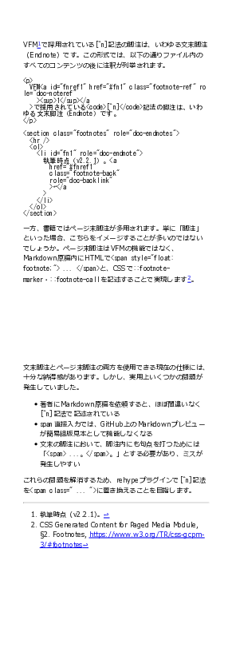

# @u1f992/vfm-endnote-to-footnote

Transform endnotes into footnotes in [Vivliostyle Flavored Markdown](https://github.com/vivliostyle/vfm).

```
$ npm install git://github.com/u1f992/vfm-endnote-to-footnote#v0.1.0
```

```javascript
// @ts-check

import { vfmEndnoteToFootnote } from "@u1f992/vfm-endnote-to-footnote";

import { VFM } from "@vivliostyle/vfm";

/** @type {import('@vivliostyle/cli').VivliostyleConfigSchema} */
const vivliostyleConfig = {
  title: "example",
  author: "u1f992",
  language: "ja",
  theme: "./css",
  image: "ghcr.io/vivliostyle/cli:9.1.0",
  entry: ["manuscript.md"],

  documentProcessor: (opts, meta) =>
    VFM(opts, meta).use(vfmEndnoteToFootnote, {
      newTagName: "span",
      newProps: { class: "footnote" },
      transform: (footnote, endnoteCall, endnote) => {
        if (endnote.hasAttribute("id")) {
          footnote.setAttribute("id", endnote.getAttribute("id") || "");
        }
      },
    }),
};

export default vivliostyleConfig;
```

|      Endnote       |      Footnote       |
| :----------------: | :-----------------: |
|  |  |

## Related Information

- [Support CSS `@footnote` for footnote area · Issue #1045 · vivliostyle/vivliostyle.js](https://github.com/vivliostyle/vivliostyle.js/issues/1045)
